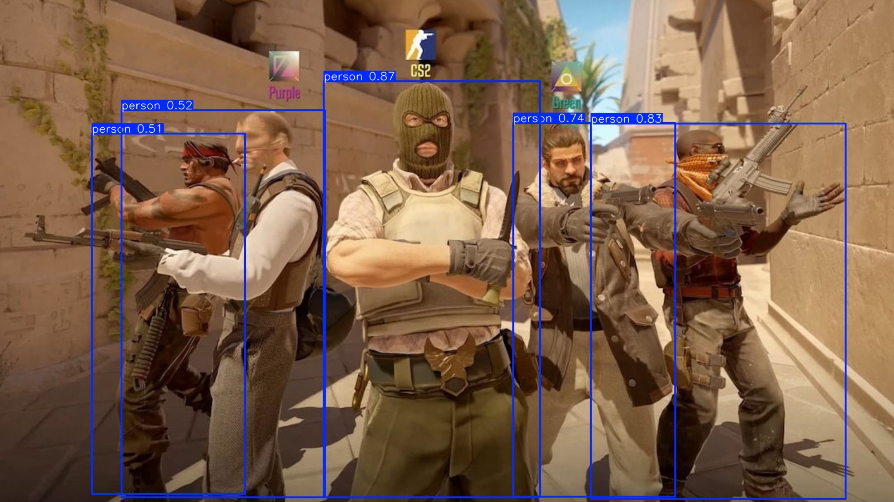

# Opsis CV Overlay System

Real-time computer vision overlay with YOLO object detection and automated mouse control. Built for research and educational purposes.

**Tech Stack**: Python 3.10+, YOLO (ultralytics), PyTorch, OpenCV, customtkinter, mss, pynput



## Features

- Real-time object detection using YOLO
- Transparent click-through overlay with bounding boxes
- Automated mouse control with smooth tracking
- GPU acceleration (CUDA/MPS/CPU)
- Hot-reloadable configuration
- Multi-monitor support
- Custom model training pipeline

## Installation

```bash
# Clone repository
git clone <repository-url>
cd opsis

# Create virtual environment
python -m venv venv
source venv/bin/activate  # Windows: venv\Scripts\activate

# Install dependencies
pip install -r requirements.txt
```

### macOS Setup

Grant required permissions:
1. System Preferences → Security & Privacy → Privacy → Accessibility
2. Add Terminal (or iTerm) and check the box
3. System Preferences → Security & Privacy → Privacy → Screen Recording
4. Add Terminal and check the box
5. Restart terminal after granting permissions

## Quick Start

```bash
# Activate virtual environment
source venv/bin/activate

# Run with default settings
python main.py

# Run on specific monitor
python main.py --monitor 2

# Run with debug logging
python main.py --debug
```

### Hotkeys

Global hotkeys (work from any window):

- **F1** - Toggle overlay visibility
- **F2** - Toggle mouse control
- **F3** - Open settings menu
- **F4** - Reload configuration
- **F5** - Exit program

## Training Custom Models

### 1. Collect Data

```bash
python scripts/collect_data.py --game "my_game" --interval 0.5
# Controls: SPACE (pause/resume), ESC (stop)
```

### 2. Annotate Images

```bash
pip install labelImg
labelImg data/raw/my_game
# Draw bounding boxes and save in YOLO format
```

### 3. Prepare Dataset

```bash
# Convert XML annotations to YOLO (if needed)
python scripts/xml_to_yolo.py data/raw/my_game

# Split into train/validation sets
python scripts/split_dataset.py data/raw/my_game \
  --output data/datasets/my_game \
  --train-ratio 0.8
```

### 4. Train Model

```bash
python scripts/train.py \
  --data data/datasets/my_game/data.yaml \
  --model yolov8n.pt \
  --epochs 100 \
  --batch 8 \
  --device mps  # Use 'cuda' for NVIDIA, 'cpu' for CPU
```

### 5. Deploy Model

Update `config/settings.json`:
```json
{
  "detection": {
    "model_path": "models/runs/my_game_character_detection/weights/best.pt"
  }
}
```

## Configuration

All settings in `config/settings.json`:

- **detection**: Model path, confidence threshold, device (cuda/mps/cpu), image size
- **overlay**: Colors, thickness, labels, transparency
- **mouse_control**: Smoothing, speed, stabilization, target priority
- **screen_capture**: FPS, monitor selection, region of interest

Configuration reloads automatically with F4 or via settings menu.

## Project Structure

```
opsis/
├── main.py                 # Application entry point
├── config/
│   └── settings.json      # Configuration file
├── src/
│   ├── capture/           # Screen capture (MSS)
│   ├── detection/         # YOLOv8 model loading & inference
│   ├── overlay/           # Transparent tkinter overlay
│   ├── control/           # Mouse controller with smoothing
│   └── gui/               # Settings menu (customtkinter)
├── scripts/
│   ├── collect_data.py    # Screenshot collection
│   ├── train.py           # Model training
│   ├── test_model.py      # Model testing & benchmarks
│   └── ...                # Additional utilities
├── models/
│   └── runs/              # Trained model weights
├── data/
│   ├── raw/               # Collected screenshots
│   └── datasets/          # Prepared training data
└── tests/                 # Test suite
```

## Testing Models

```bash
# Test on static images
python scripts/test_model.py \
  --model models/runs/my_game_character_detection/weights/best.pt \
  --source data/raw/my_game

# Test with live screen capture
python scripts/test_model.py \
  --model models/runs/my_game_character_detection/weights/best.pt \
  --live

# Benchmark performance
python scripts/test_model.py \
  --model path/to/model.pt \
  --benchmark \
  --iterations 100
```

## Troubleshooting

### Model not found
Train a model first or update `detection.model_path` in `config/settings.json`:
```json
"model_path": "models/runs/my_game_character_detection/weights/best.pt"
```

### Low FPS / Performance
- Use smaller model: `yolov8n.pt` (fastest, ~30-60 FPS)
- Enable half precision: `"half_precision": true` (CUDA/MPS only)
- Reduce image size: `"image_size": 416`
- Lower capture FPS: `"target_fps": 30`

### Hotkeys not working (macOS)
- Grant Accessibility permissions (see macOS Setup above)
- Restart terminal after granting permissions
- Check for `[KEY DEBUG]` messages in console

### Overlay not visible
- Press F1 to toggle visibility
- Check if overlay is on wrong monitor (use `--monitor` flag)
- Grant Screen Recording permissions (macOS)

### Apple Silicon (M1/M2/M3) issues
- Use `"device": "mps"` in settings.json
- Verify MPS support: `python -c "import torch; print(torch.backends.mps.is_available())"`
- Reduce batch size to 4-8 during training

## Model Sizes

Choose based on speed/accuracy tradeoff:

- **yolov8n.pt** - Nano (fastest, 6MB, recommended)
- **yolov8s.pt** - Small (balanced, 22MB)
- **yolov8m.pt** - Medium (accurate, 52MB, slower)

## Platform Support

- **macOS**: MPS device for Apple Silicon (M1/M2/M3)
- **Windows/Linux**: CUDA for NVIDIA GPUs
- **All platforms**: CPU fallback available

## Additional Documentation

- [QUICK_REFERENCE.md](QUICK_REFERENCE.md) - Command reference

## Notice

For educational and research purposes only.
